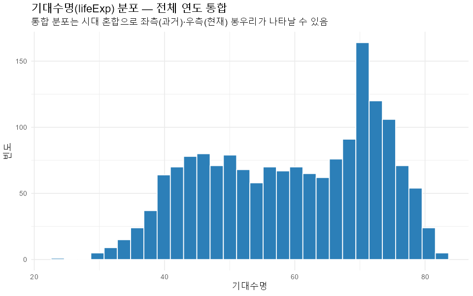
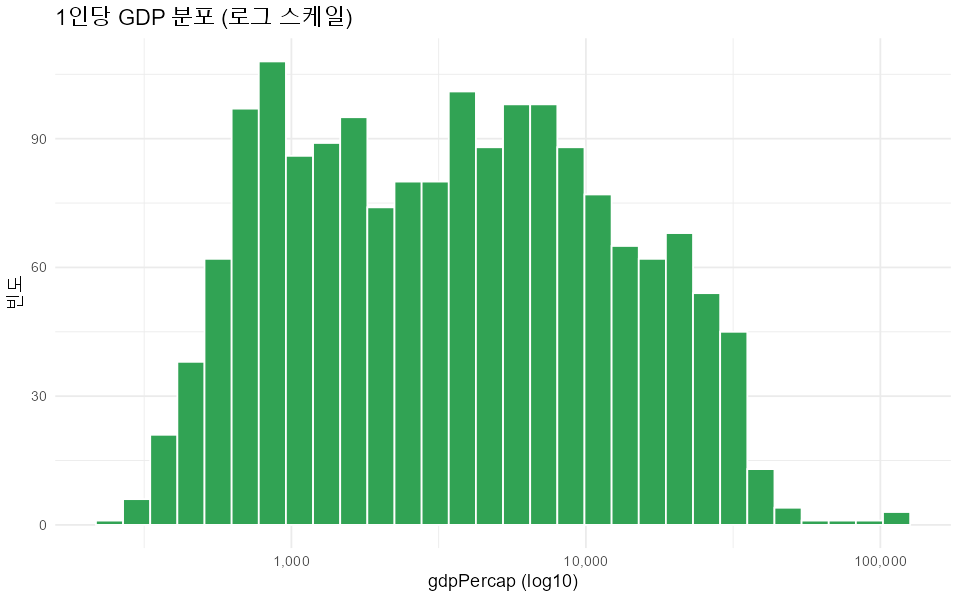
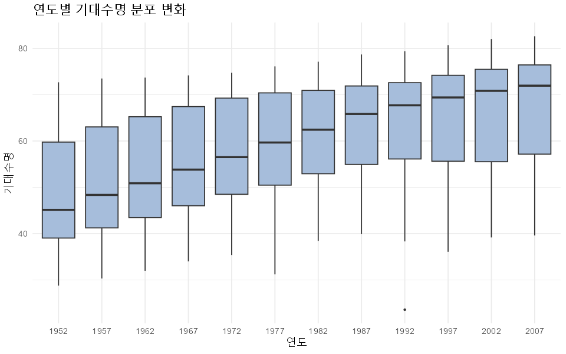
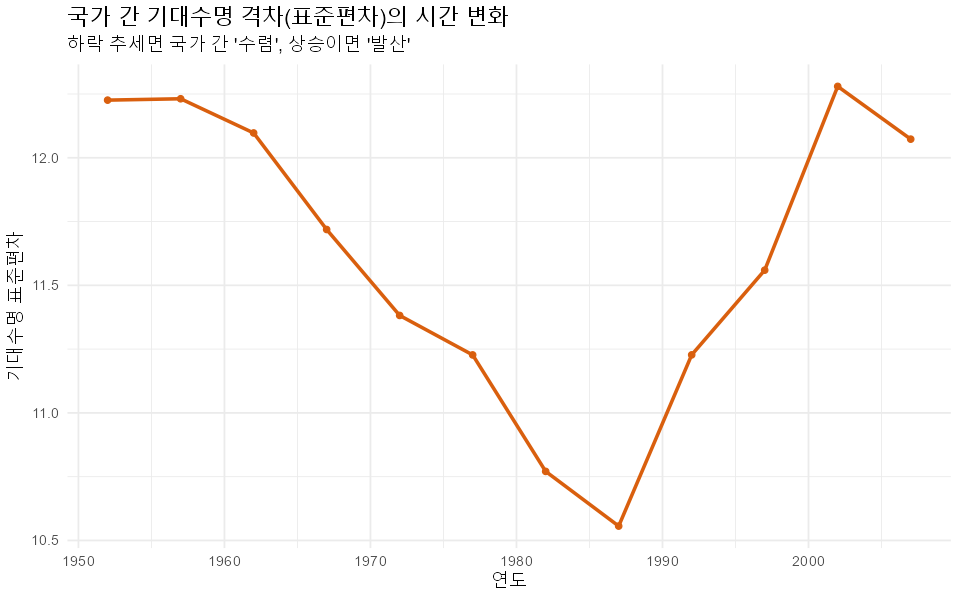
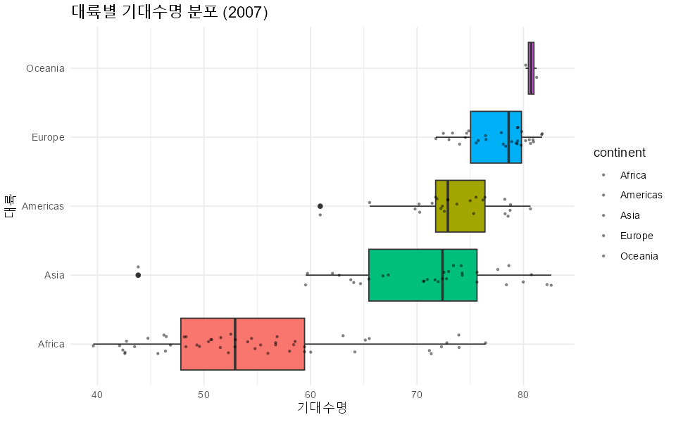
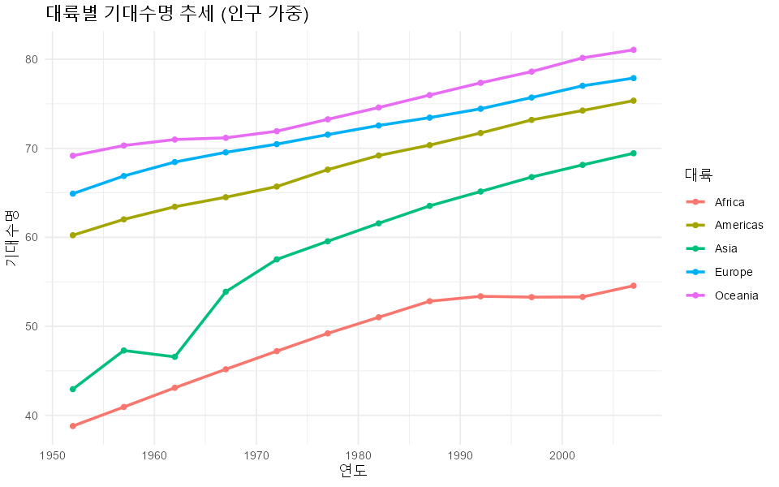
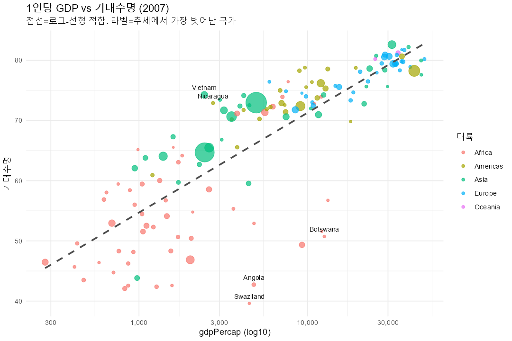
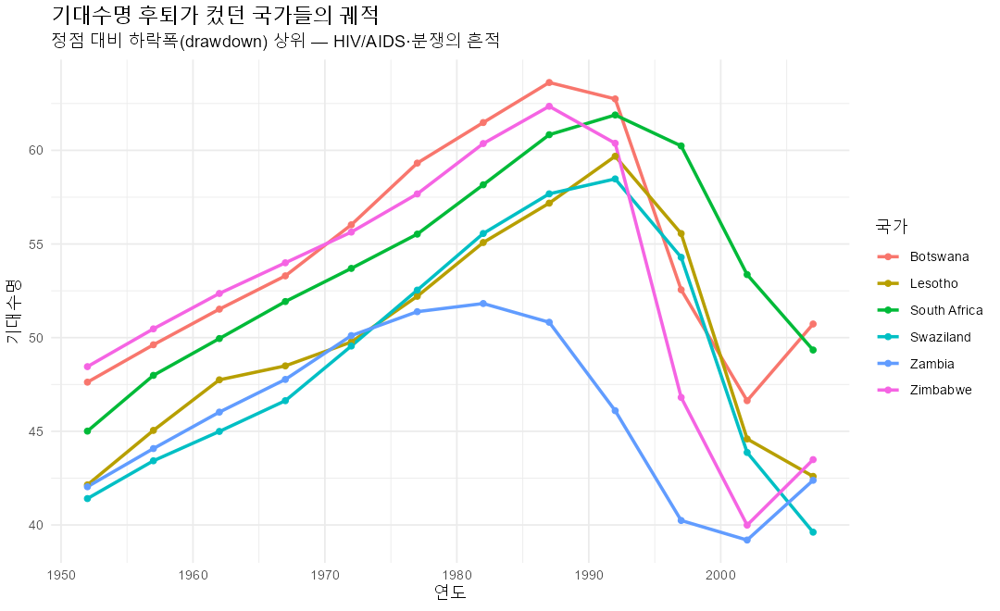

# gapminder 탐색적 분석(EDA) 보고서

- **분석 대상**: `data/gapminder_clean.csv` (1,704행, 142개국 × 12개 연도)
- **분석 스크립트**: `eda.R`
- **분석 일자**: 2026-06-27
- **실행 환경**: R 4.x (ggplot2, dplyr)
- **그림 저장 위치**: `figures/`

> 본 보고서의 수치는 `data/gapminder_clean.csv`에서 직접 산출한 실제 값이다.
> 표본 왜도/첨도/지니/잔차는 외부 패키지 없이 계산했다.

---

## 0. 데이터 무결성 점검

분포·관계 분석에 앞서 데이터 품질을 먼저 확인했다. 결론의 신뢰도는 입력 품질을 넘을 수 없기 때문이다.

| 점검 항목 | 결과 |
|-----------|------|
| 행 수 / 컬럼 | 1,704행 / 6열 |
| 결측치(NA) | **0건** |
| (국가, 연도) 키 중복 | **0건** |
| 값 범위 위반 (lifeExp≤0·>120, gdp≤0, pop≤0) | **0건** |
| 대륙 라벨 | Africa, Americas, Asia, Europe, Oceania (5종, 정상) |
| 연도 집합 | 1952–2007, 5년 간격 **12개 연도** |
| 국가 수 | 142개국 |
| 패널 균형성 | **균형 패널** (모든 국가가 12개 연도 보유) |

- **주의(데이터 함정)**: 원본 `data/gapminder.csv`는 따옴표가 없어 `Korea, Rep.`·`Congo, Dem. Rep.`·`Yemen, Rep.`처럼 **쉼표가 포함된 국가명이 열을 밀어** 대륙 라벨이 깨질 수 있다. 따옴표 처리된 `gapminder_clean.csv`를 사용하면 대륙 라벨이 정확히 5종으로 떨어진다(위 점검에서 확인). 스크립트는 매 실행 시 이 라벨 타당성을 자동 검사한다.

## 1. 주요 변수 분포 (정확한 요약 통계)

| 변수 | 평균 | 표준편차 | 최소 | Q1 | 중앙값 | Q3 | 최대 | 왜도 | 초과첨도 |
|------|------|----------|------|------|--------|------|------|------|----------|
| lifeExp | 59.47 | 12.92 | 23.60 | 48.20 | 60.71 | 70.85 | 82.60 | **−0.25** | **−1.13** |
| gdpPercap | 7,215.3 | 9,857.5 | 241.2 | 1,202.1 | 3,531.9 | 9,325.5 | 113,523.1 | **+3.85** | +27.40 |
| pop | 2,960만 | 1.06억 | 6.0만 | 279만 | 702만 | 1,959만 | 13.19억 | **+8.34** | +77.62 |

- **gdpPercap·pop**: 왜도가 크게 양(+)이고 평균이 중앙값을 크게 상회 → 강한 **우편향**. 분석·시각화 시 **로그 변환** 필수.
- **lifeExp**: 흔히 "대칭"으로 단순화되지만, 실제로는 **왜도 −0.25(약한 좌편향)**, **초과첨도 −1.13(평평/이봉 경향)**. 이는 **1952년과 2007년을 한데 모은** 탓이다. 통합 히스토그램의 두 봉우리는 "과거 저수명 국가군"과 "현재 고수명 국가군"의 혼합이며, 연도를 분리하면(그림 03) 사라진다. → **통합 분포를 단일 모집단으로 해석하면 안 된다.**

## 2. 시간에 따른 추세 — 중심(가중평균) + 격차(분산·지니)

가중평균만 보면 "중심"은 보이지만 "격차"는 보이지 않는다. 인구 가중/비가중 평균과 함께 국가 간 **표준편차·지니계수**를 보고한다.

| 연도 | 가중평균 수명 | 비가중평균 수명 | 가중 1인당GDP | 총인구 | 수명 SD | 수명 지니 | GDP 지니 |
|------|---------------|------------------|----------------|--------|---------|-----------|----------|
| 1952 | 48.94 | 49.06 | 2,924 | 24.1억 | 12.23 | 0.141 | 0.587 |
| 1957 | 52.12 | 51.51 | 3,339 | 26.6억 | 12.23 | 0.135 | 0.585 |
| 1962 | 52.32 | 53.61 | 3,795 | 29.0억 | 12.10 | 0.129 | 0.567 |
| 1967 | 56.98 | 55.68 | 4,428 | 32.2억 | 11.72 | 0.120 | 0.560 |
| 1972 | 59.51 | 57.65 | 5,150 | 35.8억 | 11.38 | 0.113 | 0.572 |
| 1977 | 61.24 | 59.57 | 5,679 | 39.3억 | 11.23 | 0.107 | 0.551 |
| 1982 | 62.88 | 61.53 | 5,917 | 42.9억 | 10.77 | 0.100 | 0.537 |
| 1987 | 64.42 | 63.21 | 6,423 | 46.9억 | **10.56** | **0.094** | 0.548 |
| 1992 | 65.65 | 64.16 | 6,751 | 51.1억 | 11.23 | 0.097 | 0.565 |
| 1997 | 66.85 | 65.01 | 7,435 | 55.2억 | 11.56 | 0.099 | 0.571 |
| 2002 | 67.84 | 65.69 | 8,029 | 58.9억 | 12.28 | 0.104 | 0.574 |
| 2007 | 68.92 | 67.01 | 9,296 | 62.5억 | 12.07 | 0.100 | 0.568 |

- 55년간 가중평균 기대수명 **+20.0년**(48.9 → 68.9세), 가중 1인당 GDP **약 3.2배**(2,924 → 9,296).
- **가중평균 > 비가중평균** 구간(1967년 이후) → 인구가 많은 국가(중국·인도 등)가 평균적 국가보다 양호하게 개선됨을 시사.
- **격차는 U자형**: 국가 간 수명 SD가 1952년 12.23 → **1987년 10.56까지 수렴**한 뒤 → 2002년 12.28로 **재발산**. 1990년대 HIV/AIDS(남부 아프리카)와 체제전환기 충격이 원인으로 추정. **"꾸준한 수렴"이라는 단순 서사는 틀렸다.**
- 소득 불평등(GDP 지니 ≈ 0.55–0.59)은 수명 불평등(지니 ≈ 0.1)보다 훨씬 크고, 55년간 큰 추세 변화 없이 높게 유지.

## 3. 대륙별 비교 (2007년 기준)

| 대륙 | 국가 수 | 기대수명(중앙값) | 수명 IQR(내부격차) | 1인당 GDP(중앙값) | 총인구 |
|------|---------|------------------|--------------------|-------------------|--------|
| Oceania | 2 | 80.72 | 0.52 | 29,810 | 0.02억 |
| Europe | 30 | 78.61 | 4.78 | 28,054 | 5.86억 |
| Americas | 25 | 72.90 | 4.63 | 8,948 | 8.99억 |
| Asia | 33 | 72.40 | **10.15** | 4,471 | 38.12억 |
| **Africa** | 52 | **52.93** | **11.61** | **1,452** | 9.30억 |

- 아프리카가 기대수명·소득 모두에서 큰 격차로 최하위.
- **중앙값만으로는 부족하다**: IQR을 보면 **아프리카(11.6)·아시아(10.2)는 대륙 내부 이질성이 매우 크다.** 유럽·아메리카(약 5)와 달리, 두 대륙은 "하나의 대륙"으로 묶어 말하기 어렵다(아시아: 일본·홍콩 vs 아프가니스탄; 아프리카: 북아프리카 vs 사하라 이남).

## 4. 1인당 GDP와 기대수명의 관계

| 측정 방식 | 상관계수 |
|-----------|----------|
| 통합 · 원자료 | 0.584 |
| 통합 · log10(GDP) | 0.808 |
| **2007년 단면 · log10(GDP)** | **0.809** |

- 소득과 기대수명은 양의 상관이며, **로그 변환 시 선형성이 뚜렷**해진다(0.584 → 0.808).
- **통합 상관의 함정**: 통합(pooled) 상관 0.808은 "국가 간 차이"와 "시간에 따른 동반 상승(둘 다 우상향)"을 **뒤섞은** 값이다. 따라서 단일 연도 단면 상관과 비교해야 한다. 다행히 2007년 단면 상관도 0.809로 견고하나, **연도별 단면 상관은 0.748(1952) → 0.874(1987) → 0.809(2007)로 변동**한다(2절 표). 관계의 강도 자체가 시대에 따라 달라지므로 "하나의 상수"로 말하면 안 된다.
- 일정 소득 이상에서 기대수명 증가가 둔화되는 **포화(수확 체감)** 경향이 로그 스케일에서도 관찰된다.

**2007년 로그-선형 회귀** `lifeExp ~ log10(gdpPercap)`: R² = **0.654**, 기울기 ≈ 16.6 (GDP 10배당 +16.6년).

회귀선에서 가장 벗어난 국가(잔차)는 "돈으로 설명 안 되는" 사례를 드러낸다:

**소득 대비 수명이 낮은 국가(음의 잔차)** — 2007년엔 산유국이 아니라 **HIV/AIDS 피해 남부 아프리카가 지배적**:

| 국가 | 대륙 | 기대수명 | 1인당 GDP | 잔차 |
|------|------|----------|-----------|------|
| Swaziland | Africa | 39.6 | 4,513 | −25.9 |
| Angola | Africa | 42.7 | 4,797 | −23.3 |
| Botswana | Africa | 50.7 | 12,570 | −22.2 |
| South Africa | Africa | 49.3 | 9,270 | −21.4 |
| Equatorial Guinea | Africa | 51.6 | 12,154 | −21.1 |

**소득 대비 수명이 높은 국가(양의 잔차)** — 저소득에도 보건 성과가 우수:

| 국가 | 대륙 | 기대수명 | 1인당 GDP | 잔차 |
|------|------|----------|-----------|------|
| Vietnam | Asia | 74.2 | 2,442 | +13.1 |
| Nicaragua | Americas | 72.9 | 2,749 | +10.9 |
| West Bank and Gaza | Asia | 73.4 | 3,025 | +10.7 |
| Comoros | Africa | 65.2 | 986 | +10.5 |
| Korea, Dem. Rep. | Asia | 67.3 | 1,593 | +9.2 |

## 5. 기대수명 순위 (2007년)

**상위 10개국**

| 국가 | 대륙 | 기대수명 | 1인당 GDP |
|------|------|----------|-----------|
| Japan | Asia | 82.60 | 31,656 |
| Hong Kong, China | Asia | 82.21 | 39,725 |
| Iceland | Europe | 81.76 | 36,181 |
| Switzerland | Europe | 81.70 | 37,506 |
| Australia | Oceania | 81.24 | 34,435 |
| Spain | Europe | 80.94 | 28,821 |
| Sweden | Europe | 80.88 | 33,860 |
| Israel | Asia | 80.75 | 25,523 |
| France | Europe | 80.66 | 30,470 |
| Canada | Americas | 80.65 | 36,319 |

**하위 10개국**

| 국가 | 대륙 | 기대수명 | 1인당 GDP |
|------|------|----------|-----------|
| Swaziland | Africa | 39.61 | 4,513 |
| Mozambique | Africa | 42.08 | 824 |
| Zambia | Africa | 42.38 | 1,271 |
| Sierra Leone | Africa | 42.57 | 863 |
| Lesotho | Africa | 42.59 | 1,569 |
| Angola | Africa | 42.73 | 4,797 |
| Zimbabwe | Africa | 43.49 | 470 |
| Afghanistan | Asia | 43.83 | 975 |
| Central African Republic | Africa | 44.74 | 706 |
| Liberia | Africa | 45.68 | 415 |

- 상위권은 유럽·동아시아 선진국, 하위권은 대부분 사하라 이남 아프리카.
- 하위권 안에서도 **Swaziland·Angola는 소득이 4,500달러 이상**인데 수명이 최하위 — 소득만으로 설명되지 않는 보건 위기(HIV/AIDS·분쟁)를 시사(4절 잔차 분석과 일치).

## 6. 변화 — 개선폭 **그리고** 후퇴/역전 (1952 → 2007)

> 기존 분석은 "개선 상위"만 보았다. 균형 잡힌 EDA는 같은 비중으로 **악화/후퇴**도 봐야 한다.

**기대수명 개선폭 상위 10개국**

| 국가 | 대륙 | 1952 | 2007 | 증가폭 |
|------|------|------|------|--------|
| Oman | Asia | 37.58 | 75.64 | **+38.06** |
| Vietnam | Asia | 40.41 | 74.25 | +33.84 |
| Indonesia | Asia | 37.47 | 70.65 | +33.18 |
| Saudi Arabia | Asia | 39.88 | 72.78 | +32.90 |
| Libya | Africa | 42.72 | 73.95 | +31.23 |
| Korea, Rep. | Asia | 47.45 | 78.62 | +31.17 |
| Nicaragua | Americas | 42.31 | 72.90 | +30.59 |
| West Bank and Gaza | Asia | 43.16 | 73.42 | +30.26 |
| Yemen, Rep. | Asia | 32.55 | 62.70 | +30.15 |
| Gambia | Africa | 30.00 | 59.45 | +29.45 |

**기간 내 순(純)후퇴 국가** (2007년 < 1952년) — 전 세계에서 단 **2개국**:

| 국가 | 대륙 | 1952 | 2007 | 증가폭 |
|------|------|------|------|--------|
| Zimbabwe | Africa | 48.5 | 43.5 | **−5.0** |
| Swaziland | Africa | 41.4 | 39.6 | **−1.8** |

**정점 대비 최대 후퇴(drawdown) 상위 10** — 시작·끝만 보면 놓치는 "중간의 붕괴"를 포착:

| 국가 | 대륙 | 정점 수명 | 2007 | 하락폭 |
|------|------|-----------|------|--------|
| Zimbabwe | Africa | 62.4 | 43.5 | **−18.9** |
| Swaziland | Africa | 58.5 | 39.6 | **−18.9** |
| Lesotho | Africa | 59.7 | 42.6 | −17.1 |
| Botswana | Africa | 63.6 | 50.7 | −12.9 |
| South Africa | Africa | 61.9 | 49.3 | −12.5 |
| Zambia | Africa | 51.8 | 42.4 | −9.4 |
| Namibia | Africa | 62.0 | 52.9 | −9.1 |
| Cote d'Ivoire | Africa | 54.7 | 48.3 | −6.3 |
| Central African Republic | Africa | 50.5 | 44.7 | −5.7 |
| Iraq | Asia | 65.0 | 59.5 | −5.5 |

- 순후퇴는 2개국뿐이지만, **drawdown으로 보면 남부 아프리카 전역의 보건 붕괴(HIV/AIDS)** 가 뚜렷하다. 보츠와나·남아공은 한때 60세를 넘겼다가 50세 안팎으로 추락했다(소득은 오히려 높음 → 4절 음의 잔차와 동일 집단).
- 시작·끝 두 점만 비교하면 이 위기를 **완전히 놓친다.** 이것이 개선폭만 보던 기존 분석의 가장 큰 사각지대였다.

---

## 결론

1. **데이터 품질**: 균형 패널(142국 × 12년), 결측·중복·범위 위반 0건. 단, 원본 비(非)따옴표 CSV는 쉼표 국가명으로 열 밀림 위험 → `_clean.csv` 사용·라벨 검증 필수.
2. **전반적 향상**: 1952–2007년 가중평균 기대수명 +20년, 소득 약 3.2배. 그러나 **수렴은 단조롭지 않고 U자형** — 1980년대 후반 최대 수렴 후 1990년대 재발산.
3. **소득–수명 연관**: log10(GDP)와 강한 양의 상관(통합 0.81, 2007 단면 0.81)이나 **통합 상관은 시대·국가 효과의 혼합**이며, 연도별로 0.75–0.87 사이를 오간다. 고소득 구간에서 수확 체감.
4. **돈으로 설명 안 되는 사례**: 남부 아프리카(스와질란드·보츠와나·남아공)는 중상위 소득에도 HIV/AIDS로 수명 최하위(큰 음의 잔차); 베트남·니카라과 등은 저소득에도 우수한 보건 성과(큰 양의 잔차).
5. **개선과 후퇴의 공존**: 오만·베트남·한국(+31년)이 빠르게 추격한 한편, **남부 아프리카는 정점 대비 12–19년 후퇴**했다. 개선만 보는 분석은 이 위기를 놓친다.